<div align="center">


<br>


<br>

[](https://github.com/santheesh73)
[](https://github.com/santheesh73?tab=repositories)
[](https://github.com/santheesh73)

</div>

---

<div align="center">
  
</div>

---

## 🎯 What I Build

<table>
<tr>
<td width="33%" valign="top">

### 🤖 Generative AI
Frontier LLM applications focused on structured data extraction, contextual reasoning, and intelligent task synthesis.

</td>
<td width="33%" valign="top">

### 🧠 LLM Applications
Domain-specific intelligent products combining foundation models with deterministic software logic.

</td>
<td width="33%" valign="top">

### 🔎 RAG & Knowledge
Production retrieval architectures with vector embeddings, semantic search, and verified citations.

</td>
</tr>
<tr>
<td width="33%" valign="top">

### ⚡ On-Device AI
Zero-cloud local inference running in browsers via WebGPU and WebLLM for complete privacy.

</td>
<td width="33%" valign="top">

### 🛠️ AI Developer Tools
Codebase intelligence, structural parsing, and automated software analysis pipelines.

</td>
<td width="33%" valign="top">

### 💻 Full-Stack Products
End-to-end applications built with modern reactive frontends and high-performance asynchronous APIs.

</td>
</tr>
</table>

---

## 🛠️ Tech Stack

<div align="center">

<p>
<b>Languages</b><br>

</p>

<p>
<b>Frontend</b><br>

</p>

<p>
<b>Backend & APIs</b><br>

</p>

<p>
<b>AI & Machine Learning</b><br>


</p>

<p>
<b>Models & Platforms</b><br>


</p>

<p>
<b>Databases & Vector Stores</b><br>
<br>


</p>

<p>
<b>DevOps & Tools</b><br>


</p>

</div>

---

## 🌟 Featured Projects

<table>
<tr>
<td width="50%" valign="top">

### 🎵 HeartTune
**Premium music streaming experience.**

`PWA` • `High-Fidelity Audio` • `Offline Playlists`

`Next.js` • `React` • `TypeScript` • `Supabase` • `Redis`

<br>

<a href="https://github.com/santheesh73/HeartTune">
  
</a>

</td>
<td width="50%" valign="top">

### 🧠 NISF
**AI-powered creative intelligence platform.**

`Multimodal GenAI` • `Asset Scoring` • `Optimization`

`FastAPI` • `Python` • `Next.js` • `PostgreSQL` • `Groq`

<br>

<a href="https://github.com/santheesh73/NISF_V2">
  
</a>

</td>
</tr>

<tr>
<td width="50%" valign="top">

### 🔍 AHAL
**AI-powered software intelligence platform.**

`Repository Analysis` • `Architecture Mapping` • `Codebase Q&A`

`React` • `TypeScript` • `FastAPI` • `MongoDB` • `Gemma`

<br>

<a href="https://github.com/santheesh73/AHAL-V2">
  
</a>

</td>
<td width="50%" valign="top">

### 💎 PRYSM
**AI audit & compliance intelligence platform.**

`Pre-Audit Checks` • `Financial OCR` • `Semantic Search`

`Next.js` • `FastAPI` • `Python` • `PyMuPDF` • `ChromaDB`

<br>

<a href="https://github.com/santheesh73/PRYSM---Continuous-AI-Compilance-Operating-System">
  
</a>

</td>
</tr>

<tr>
<td width="50%" valign="top">

### 🛰️ Orion
**Private, offline-first on-device AI assistant.**

`Zero Cloud` • `Browser WebGPU LLM` • `IndexedDB`

`Next.js` • `TypeScript` • `WebGPU` • `WebLLM` • `PWA`

<br>

<a href="https://github.com/santheesh73/Orion">
  
</a>

</td>
<td width="50%" valign="top">

### 🌾 BHOOMI
**AI agriculture & farmer intelligence system.**

`Voice-First UI` • `Crop Disease Vision` • `Localized Alerts`

`Python` • `React` • `FastAPI` • `PyTorch` • `Gemini`

<br>

<a href="https://github.com/santheesh73/Bhoomi-SIH-Agri">
  
</a>

</td>
</tr>

<tr>
<td colspan="2" valign="top">

### ⚡ MINCHAL
**AI-assisted electricity bill & energy intelligence.**

`Bill Vision OCR` • `Deterministic Calculation Engine` • `ROI Recommendations`

`React` • `TypeScript` • `Vite` • `FastAPI` • `Python` • `Gemini Vision` • `PWA`

<br>

<a href="https://github.com/santheesh73/Minchal-deploy">
  
</a>

</td>
</tr>
</table>

---

## ⚙️ Engineering Philosophy

<div align="center">

```text
Problem ──► Understand ──► Build ──► Integrate AI ──► Test ──► Deploy ──► Improve
```

</div>

> **AI + Deterministic Logic + Good UX + Reliable Engineering**  
> *AI should be a component of a reliable software system, not the entire system.* Complex applications require combining AI perception and semantic extraction with deterministic calculations, rigorous validation, and intuitive user experiences.

---

## 🔬 Engineering Interests

<table>
<tr>
<th width="33%" align="center">🤖 AI SYSTEMS</th>
<th width="33%" align="center">🔎 KNOWLEDGE SYSTEMS</th>
<th width="33%" align="center">💻 PRODUCT ENGINEERING</th>
</tr>
<tr>
<td valign="top">

- Large Language Models (LLMs)
- Autonomous AI Agents
- On-Device AI & WebGPU
- Structured Output Extraction
- Local Model Execution

</td>
<td valign="top">

- Retrieval-Augmented Generation (RAG)
- Vector Embeddings & Similarity Search
- Document Intelligence & OCR
- Semantic Codebase Analysis
- Deterministic Verification Engines

</td>
<td valign="top">

- React & Next.js Architecture
- High-Throughput FastAPI Services
- Relational & Document Databases
- Offline-First PWA Systems
- Resilient API Design

</td>
</tr>
</table>

---

## 🚀 Current Focus

- 🧠 **LLM Engineering & Agents**: Production-grade agentic workflows with deterministic validation.
- ⚡ **On-Device Inference**: Advancing browser-native local models via WebGPU & WebLLM.
- 🔎 **High-Precision RAG**: Hybrid retrieval pipelines with vector embeddings and semantic reranking.
- 📄 **Document Intelligence**: Structured multi-format extraction for compliance and audits.

---

## 📊 GitHub Analytics

<div align="center">

<a href="https://github.com/santheesh73">
  
</a>
<a href="https://github.com/santheesh73">
  
</a>

<br><br>

<a href="https://github.com/santheesh73">
  
</a>

<br><br>

<picture>
  <source media="(prefers-color-scheme: dark)" srcset="https://raw.githubusercontent.com/santheesh73/santheesh73/output/github-contribution-grid-snake-dark.svg" />
  <source media="(prefers-color-scheme: light)" srcset="https://raw.githubusercontent.com/santheesh73/santheesh73/output/github-contribution-grid-snake.svg" />
  
</picture>

</div>

---

## 🤝 Connect

<div align="center">

**Let's build something useful.**

<br>

<a href="https://github.com/santheesh73">
  
</a>
<a href="https://github.com/santheesh73?tab=repositories">
  
</a>
<a href="https://github.com/santheesh73?tab=stars">
  
</a>

<br><br>

### **Think Deeply. Build Deliberately. Ship Continuously.**

<sub>Building reliable intelligent software, one system at a time.</sub>

<br>


</div>
