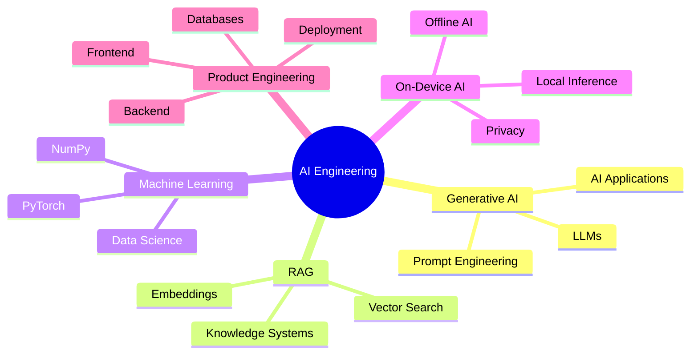

<div align="center">

<h1>Hi, I'm SANTHEESH S 👋</h1>


<br>

<a href="https://github.com/santheesh73">
  
</a>
<a href="https://github.com/santheesh73?tab=repositories">
  
</a>


<br><br>

<a href="#about-me">About</a> •
<a href="#tech-stack">Stack</a> •
<a href="#featured-builds">Projects</a> •
<a href="#engineering-focus">Focus</a> •
<a href="#github-analytics">Analytics</a> •
<a href="#connect">Connect</a>

</div>

---

## About Me

> **I build intelligent software that turns ideas into real products.**

I'm an **AI & Data Science developer** focused on practical, production-oriented applications across **Artificial Intelligence, Generative AI, LLMs, RAG, and Full-Stack Development**.

I enjoy taking ideas from **problem discovery to product design, engineering, AI integration, deployment, and iteration**.

### What I Build

- 🤖 Generative AI and LLM-powered applications
- 🔎 RAG and knowledge-based AI systems
- 💻 Modern full-stack web applications
- ⚙️ Production-ready backend APIs
- 🔐 Privacy-first and local AI experiences
- 🏆 Hackathon solutions and real-world products
- 🚀 AI-powered developer and productivity tools

---

## Tech Stack

<div align="center">

### Languages


<br><br>

### Frontend


<br><br>

### Backend


<br><br>

### AI / Machine Learning


<br><br>


<br><br>

### Databases & Infrastructure


<br><br>

### Developer Tools


</div>

---

## Featured Builds

<table>
<tr>
<td width="50%" valign="top">

### 🎵 HeartTune

**Premium Music Streaming PWA**

A modern music streaming experience with authentication, music streaming, playlists, responsive UI, and offline capabilities.

**Stack**

`Next.js` `React` `TypeScript` `Tailwind CSS`  
`Supabase` `PostgreSQL` `Redis` `JioSaavn API`

</td>

<td width="50%" valign="top">

### 🛰️ Orion (OSDC)

**Private AI. Zero Cloud. Infinite Possibilities.**

An offline-first AI experience focused on local inference, privacy, and on-device intelligence.

**Focus**

`On-Device AI` `Local LLM` `Offline AI` `Privacy`

</td>
</tr>

<tr>
<td width="50%" valign="top">

### 🧠 NISF

**AI Creative Intelligence Platform**

A production-oriented platform for generating and optimizing text, image, audio, and video marketing content.

**Stack**

`Next.js` `FastAPI` `PostgreSQL` `Redis` `Docker`  
`Groq LLaMA 3` `Hugging Face` `Celery`

</td>

<td width="50%" valign="top">

### 🔍 AHAL

**AI Software Intelligence Platform**

Analyzes repositories and documents to generate project insights, architecture understanding, and interactive AI-assisted reports.

**Stack**

`React` `TypeScript` `FastAPI` `Python`  
`MongoDB` `JWT` `Gemma`

</td>
</tr>

<tr>
<td width="50%" valign="top">

### 💎 PRYSM

**Intelligent Software Experience**

A product-focused project combining modern software engineering with intelligent automation and AI-driven workflows.

**Stack**

`AI` `Full Stack` `TypeScript` `Python`

</td>

<td width="50%" valign="top">

### 🎯 Talent Mind

**AI-Powered Recruitment Platform**

Analyzes job descriptions and candidate resumes to generate intelligent candidate rankings, explainable insights, and reports.

**Stack**

`React` `Vite` `TypeScript` `FastAPI`  
`Python` `SQLite` `Gemini API`

</td>
</tr>
</table>

---

## Engineering Focus

<div align="center">

| 🤖 Generative AI | 🔎 RAG | ⚡ On-Device AI | 💻 Full Stack |
|---|---|---|---|
| LLM Applications | Embeddings | Local Inference | React |
| Prompt Engineering | Vector Search | Offline AI | Next.js |
| AI Workflows | Knowledge Systems | Privacy | FastAPI |

</div>

---

## How I Build

<div align="center">

```text
Problem
   ↓
Research
   ↓
Design
   ↓
Build
   ↓
AI Integration
   ↓
Testing
   ↓
Deployment
   ↓
Iteration
```

</div>

---

## AI Interest Map



---

## GitHub Analytics

<div align="center">


<br><br>


</div>

---

## Contribution Activity

<div align="center">


</div>

---

## GitHub Trophies

<div align="center">


</div>

---

## Contribution Snake

<div align="center">


</div>

<details>
<summary><b>⚙️ Contribution Snake Setup</b></summary>

<br>

The snake animation requires a GitHub Actions workflow in the profile repository.

Create:

`.github/workflows/snake.yml`

Configure the workflow to generate:

`output/github-contribution-grid-snake.svg`

</details>

---

## Current Focus

<div align="center">


</div>

---

## 2026 Roadmap

<details open>
<summary><b>What I'm working toward</b></summary>

<br>

| Goal | Status |
|---|---|
| Production-grade AI applications | 🔄 In Progress |
| Advanced LLM engineering | 🔄 In Progress |
| Efficient RAG systems | 🔄 In Progress |
| Local & On-Device AI | 🔄 In Progress |
| Backend & API engineering | 🔄 In Progress |
| Open-source contributions | 🎯 Planned |
| Hackathon projects | 🔄 Active |
| Real-world product development | 🔄 Active |

</details>

---

## Developer Principles

<div align="center">

> **Think deeply. Build deliberately. Ship continuously.**

`PROBLEM SOLVING` • `PRODUCT THINKING` • `ENGINEERING` • `AI` • `ITERATION`

</div>

---

## Connect

<div align="center">

### Let's build something meaningful.

**AI • Full-Stack • Open Source • Hackathons • Developer Tools**

<br>

<a href="https://github.com/santheesh73">
  
</a>

</div>

---

<div align="center">


### **Think. Build. Ship. Iterate.**

<sub>Building intelligent software, one idea at a time.</sub>

</div>
